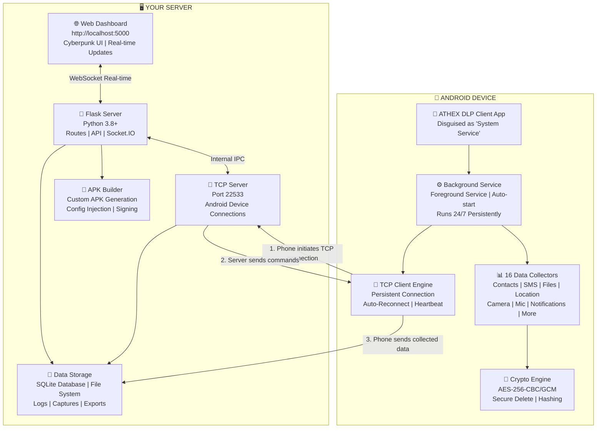
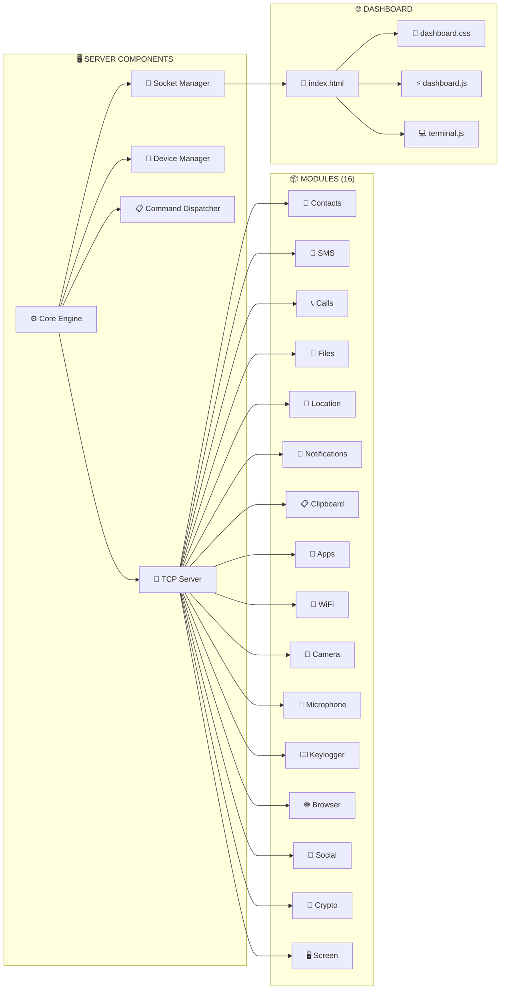
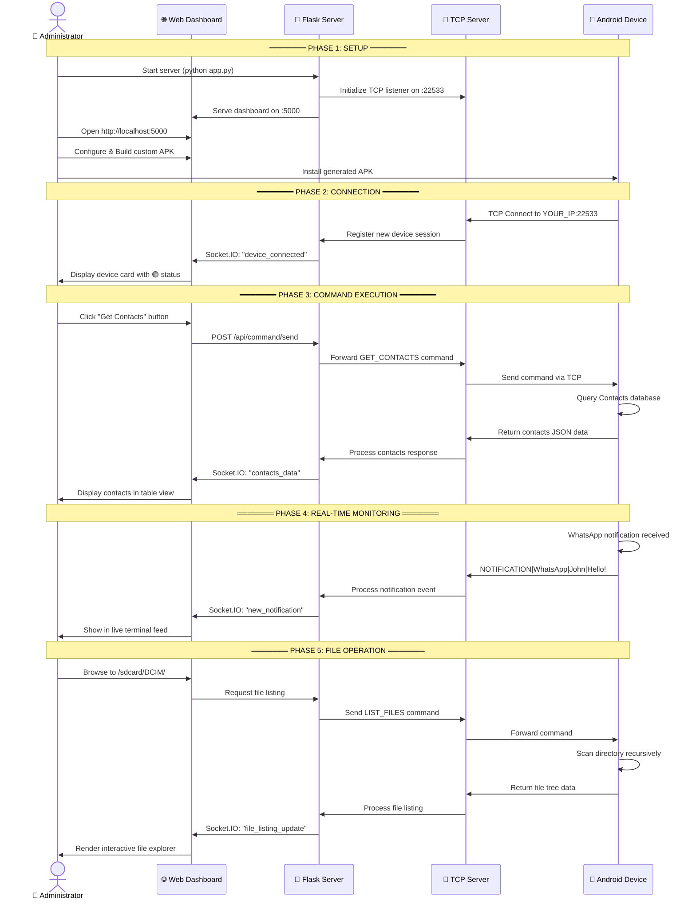

<p align="center">
  
</p>

<p align="center">
  
</p>

<p align="center">
  
  
  
  
  
</p>

<p align="center">
  
  
  
  
  
  
</p>

<br />

---

# 📚 ATHEX DLP ENTERPRISE - COMPLETE DOCUMENTATION

## 📖 TABLE OF CONTENTS

1. [📋 Overview](#-overview)
2. [🏗️ System Architecture](#-system-architecture)
3. [🔄 How It Works](#-how-it-works)
4. [✨ Features](#-features)
5. [📦 Installation Guide](#-installation-guide)
   - [Windows](#windows-installation)
   - [Linux](#linux-installation)
   - [macOS](#macos-installation)
   - [Termux (Android)](#termux-android-installation)
   - [Docker](#docker-installation)
6. [🚀 Quick Start](#-quick-start)
7. [📱 Android Client Setup](#-android-client-setup)
8. [🌐 Dashboard Guide](#-dashboard-guide)
9. [🔨 APK Builder Guide](#-apk-builder-guide)
10. [📡 Connection Setup](#-connection-setup)
11. [📁 Project Structure](#-project-structure)
12. [🔐 Security](#-security)
13. [📡 API Reference](#-api-reference)
14. [🔧 Troubleshooting](#-troubleshooting)
15. [❓ FAQ](#-faq)
16. [🤝 Contributing](#-contributing)
17. [⚠️ Disclaimer](#-disclaimer)
18. [📞 Support](#-support)

---

# 📋 OVERVIEW

## What is ATHEX DLP Enterprise?

**ATHEX DLP Enterprise** is a professional-grade, open-source **Remote Administration & Data Security Platform** specifically designed for Android devices. It provides a complete ecosystem for security researchers, penetration testers, and enterprise IT administrators to monitor, manage, and secure Android devices through a centralized web dashboard.

### Core Capabilities

| Capability | Description |
|------------|-------------|
| 🔍 **Real-time Monitoring** | Live device status, notification mirroring, GPS tracking |
| 📊 **Data Collection** | 16 specialized modules for comprehensive data gathering |
| 🎛️ **Remote Control** | Execute commands, browse files, capture media remotely |
| 🔐 **Data Security** | AES-256 encryption, secure file deletion, encrypted transport |
| 📱 **Custom APK Builder** | Generate tailored Android clients with custom configurations |
| 🌐 **Web Dashboard** | Beautiful cyberpunk-themed interface with real-time updates |

### Who Should Use This?

| User Type | Use Case |
|-----------|----------|
| 🔬 **Security Researchers** | Analyze Android security mechanisms, test vulnerabilities |
| 🛡️ **Penetration Testers** | Conduct authorized security assessments on Android devices |
| 📚 **Students & Educators** | Learn about Android internals, networking, and cybersecurity |
| 🏢 **Enterprise IT** | Manage company-owned devices with proper consent and authorization |
| 👨‍💻 **Developers** | Study the codebase, contribute to open-source security tools |

### Key Metrics

| Metric | Value |
|--------|-------|
| 📁 Total Files | 68+ |
| 💻 Total Code Lines | 20,000+ |
| 🐍 Python Files | 28 server modules |
| ☕ Java Files | 20 Android modules |
| 📱 Data Collectors | 16 specialized modules |
| 🎨 Dashboard Pages | 6 interactive pages |
| 🔌 API Endpoints | 20+ REST endpoints |
| 📡 Real-time Events | 15+ Socket.IO events |

---

##🏗️ SYSTEM ARCHITECTURE

## High-Level Architecture


## Component Architecture


## 🔄 HOW IT WORKS


##  Flow (Detailed)

```STEP 1: YOU START THE SERVER
  $ cd server                                               
  $ python app.py                                           
                                                             

    🌐 Web Dashboard: http://127.0.0.1:5000             
    📱 TCP Server:    0.0.0.0:22533                     
                                                             
  ✓ Flask web server running on port 5000                   
  ✓ TCP server listening on port 22533                      
  ✓ Waiting for Android device connections...               
```

## STEP 2: YOU BUILD A CUSTOM APK

  1. Open dashboard → APK Builder page                       
  2. Enter YOUR server IP address (e.g., 192.168.1.100)    
  3. Enter port: 22533                                      
  4. Enter app display name: "System Service"               
  5. Select features to include                             
  6. Click "⚡ BUILD APK NOW"                               
  7. Download the generated APK file                        
                                                             
  The APK now has YOUR server IP/port hardcoded inside      


## STEP 3: INSTALL APK ON ANDROID DEVICE

  1. Transfer APK to Android device (USB/cloud/email)       
  2. Enable "Install from Unknown Sources" in Settings      
  3. Install the APK                                        
  4. Open the app (appears as "System Service")            
  5. Grant ALL requested permissions when prompted          
  6. Enable Notification Listener in Android Settings       
  7. Enable Accessibility Service in Android Settings       
  The app starts a foreground service automatically         

## STEP 4: DEVICE AUTO-CONNECTS
```
  Android Phone ────TCP────▶ Your Server (Port 22533)       
                                                             
  Phone sends device information:                            
  DEVICE_INFO|Samsung S24 Ultra|Android 14|device_id|IP    
                                                             
  Server registers the device and creates a session         
  Dashboard immediately shows:                              
    🟢 Samsung S24 Ultra                    
    Android 14 | 192.168.1.150             
        [⚡ MANAGE]                  
```       
## ✨ FEATURES
###  Device Management
| Feature 	                    |                       Description |
|-------------------------------|-----------------------------------|
| Real-time Status  |	       | Live connection status, battery level, network type|
| Multi-Device	    |        | Support for 100+ simultaneous device connections|
| Device Groups     |        | Organize by model, Android version, online/offline status|
| Session Tracking	|        | Monitor connection duration, data transferred, commands executed|
| Offline Detection |        | Track when devices go offline with timestamp and reason|

#	Module	Capabilities	Command Trigger

1.	📇 Contacts	Names, phones, emails, organizations, addresses, notes	GET_CONTACTS
2.	💬 SMS	All messages, conversations, MMS, send SMS, export	GET_SMS
3.	📞 Calls	Call history, duration, type filtering, contact grouping	GET_CALL_LOGS
4.	📁 Files	Directory browsing, download, upload, delete, rename	LIST_FILES
5.	📍 Location	GPS coordinates, address geocoding, route history	GET_LOCATION
6.	🔔 Notifications	Real-time mirroring, app filtering, keyword alerts	Auto-captured
7.	📋 Clipboard	Live monitoring, crypto address detection, credential detection	Auto-captured
8.	📱 Apps	Installed apps list, permissions audit, suspicious app detection	GET_APPS
9.	📶 WiFi	Network scanning, saved networks, signal strength, security type	SCAN_WIFI
10.	📸 Camera	Front/back photo capture, quality control	TAKE_PHOTO
11.	🎤 Microphone	Audio recording, configurable duration, format options	RECORD_AUDIO
12.	⌨️ Keylogger	Keystroke capture, password detection, app-specific logging	START_KEYLOGGER
13.	🌐 Browser	History, bookmarks, cookies, saved passwords, search terms	GET_BROWSER_DATA
14.	💬 Social Media	WhatsApp, Telegram, Instagram, Facebook Messenger, Signal	GET_SOCIAL_DATA
15.	🔐 Crypto	Wallet detection (28+ wallets), address scanning, seed phrase detection	SCAN_CRYPTO
16.	🖥️ Screen	Screenshot capture, screen recording, quality/scale control	SCREENSHOT

## 🛡️ Security Features
Feature	                   Details
AES-256 Encryption       	CBC and GCM modes for file encryption
Secure Delete	3-pass     overwrite (zeros → random → ones) before deletion
Token Authentication	SHA-256 based device verification
Encrypted Transport	All data encrypted in transit via TCP
PBKDF2 Key Derivation	100,000 iterations for password-based keys
SHA-256 Hashing	File integrity verification
Magic Bytes Header	"ATHEX" header for encrypted file identification
🔨 APK Builder
Feature	Description
Custom Builds	Inject server IP, port, app name at build time
Feature Selection	Choose which modules to include
Auto Signing	Automatic keystore generation and APK signing
Template System	Easy customization of base APK
One-Click Build	Generate APK directly from dashboard
Download Ready	Instant download after build

## Installation
git clone https://github.com/Athexblackhat/ATHEX-DLP.git
cd ATHEX-DLP

### Install dependencies
cd server
pip install -r requirements.txt

### 5. Start the server
python app.py

## 6. Open browser to http://localhost:5000

### Open Git Bash in the project directory
cd tools
bash setup.sh

### Start server
cd ../server
python app.py


## Termux Installation
### Update system packages
sudo apt update && sudo apt upgrade -y

### Install prerequisites
sudo apt install -y python3 python3-pip python3-venv git openjdk-17-jdk

### Clone repository
git clone https://github.com/Athexblackhat/ATHEX-DLP.git
cd ATHEX-DLP

### Create virtual environment (recommended)
python3 -m venv venv
source venv/bin/activate

### Install dependencies
cd server
pip install -r requirements.txt

### Start server
python3 app.py --host 0.0.0.0 --port 5000
CentOS/RHEL/Fedora

### Install prerequisites
sudo dnf install -y python3 python3-pip git java-17-openjdk

### Follow same steps as Ubuntu from step 3
Arch Linux
bash
### Install prerequisites
sudo pacman -S python python-pip git jdk17-openjdk

### Follow same steps as Ubuntu from step 3
Firewall Configuration
bash
### UFW (Ubuntu/Debian)
sudo ufw allow 22533/tcp
sudo ufw allow 5000/tcp

### Firewalld (CentOS/Fedora)
sudo firewall-cmd --permanent --add-port=22533/tcp
sudo firewall-cmd --permanent --add-port=5000/tcp
sudo firewall-cmd --reload

### iptables (Generic)
sudo iptables -A INPUT -p tcp --dport 22533 -j ACCEPT
sudo iptables -A INPUT -p tcp --dport 5000 -j ACCEPT
sudo iptables-save > /etc/iptables/rules.v4
macOS Installation
bash
### Install Homebrew (if not already installed)
/bin/bash -c "$(curl -fsSL https://raw.githubusercontent.com/Homebrew/install/HEAD/install.sh)"

### Install prerequisites
brew install python@3.11 git openjdk@17

### Clone repository
git clone https://github.com/Athexblackhat/ATHEX-DLP.git
cd ATHEX-DLP

### Create virtual environment
python3 -m venv venv
source venv/bin/activate

### Install dependencies
cd server
pip install -r requirements.txt

### Start server
python3 app.py

## Install Termux from F-Droid (NOT Google Play Store)
### Update packages
pkg update && pkg upgrade -y

### Install prerequisites
pkg install python python-pip git openjdk-17 -y

### Clone repository
git clone https://github.com/Athexblackhat/ATHEX-DLP.git
cd ATHEX-DLP

### Install dependencies
cd server
pip install -r requirements.txt

### Start server
python app.py --host 0.0.0.0 --port 5000

### Access dashboard from phone browser
*** http://localhost:5000***


<br />

---

<p align="center">
  <a href="https://github.com/Athexblackhat/ATHEX-DLP">
    
  </a>
</p>

<p align="center">
  
</p>

---

<p align="center">
  <strong>🖤 Crafted with Precision & Malice by the ATHEX Black Mermaid of Cybersecurity 🧜🏿‍♀️</strong>
</p>

<p align="center">
  <a href="https://github.com/Athexblackhat">
    
</p>

<p align="center">
  
  
  
</p>

---

<br />

<h2 align="center">💎 SUPPORT THE DEVELOPMENT</h2>

<p align="center">
  <strong>If this tool has empowered your research, assessments, or learning, consider fueling the Black Mermaid's next breakthrough.</strong>
</p>


<br />

---

<!-- DISCLAIMER SECTION -->
<h2 align="center">⚠️ LEGAL DISCLAIMER</h2>

<p align="center">
  <strong>
    ATHEX DLP Enterprise is a dual-use cybersecurity research instrument intended exclusively for authorized security testing, academic study, and the administration of devices you own or have explicit written permission to monitor.
  </strong>
</p>

<p align="center">
  Unauthorized access to computer systems and networks is a criminal offense under statutes including the Computer Fraud and Abuse Act (CFAA) 18 U.S.C. § 1030, the UK Computer Misuse Act 1990, and equivalent international legislation.
</p>

<p align="center">
  <strong>The developer, ATHEX BLACK HAT, assumes zero liability for misuse, damages, or legal repercussions arising from the unlawful deployment of this software. Users are solely and completely responsible for compliance with all applicable laws and regulations.</strong>
</p>

<p align="center">
  
  &nbsp;
  
  &nbsp;
  
</p>

<br />

---

---

<p align="center">
  <a href="https://github.com/Athexblackhat/ATHEX-DLP">
    
  </a>
</p>

<p align="center">
  <em>🌊 "In the abyss of code, the Black Mermaid reigns supreme — protector of data, architect of shadows, weaver of digital destinies." 🧜🏿‍♀️</em>
</p>

<p align="center">
  <strong>Copyright © 2026 - ATHEX BLACK HAT | All Rights Reserved</strong>
</p>

<p align="center">
  <sub>Made with 🖤, caffeine, and late-night hacking sessions.</sub>
</p>
